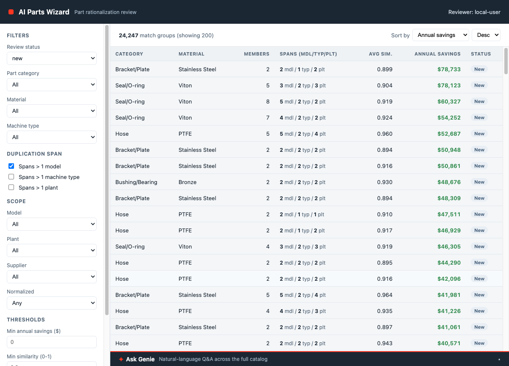

# AI Parts Wizard

**AI-Driven Part Standardization & Component Rationalization Engine** on the Databricks
Data Intelligence Platform.

A regional heavy-machinery manufacturer (tractors + harvesters across 4 plants) has the
same physical parts catalogued under different part numbers, bought from different
suppliers at different prices. This project detects duplicate parts across design centers
(a Spark batch matcher plus a **Mosaic AI Vector Search** index) so procurement can
consolidate and standardize on normalized enterprise part numbers.

All data is **synthetic** and generated by the project itself (~200K parts with seeded
duplicates and ground-truth labels).



## What gets deployed

- **Delta tables** in Unity Catalog (`<catalog>.ai_parts_wizard`) — master data, features,
  match groups, evaluation metrics.
- **Lakebase** (Postgres) — low-latency serving copies + review state written by the app.
- **Databricks App** (React + FastAPI) — Match Queue, Group Detail (supplier price gaps,
  dispositions, enterprise part-number assignment) and a docked **Ask Genie** panel.
- **Genie space** — natural-language Q&A over the catalog.
- **AI/BI dashboard** — business benefit (savings) + matching-engine quality.
- *(optional)* **Vector Search** endpoint + index for online "find similar".

## Quick start

```bash
cp deploy/config.env.example deploy/config.env   # set profile, catalog, warehouse
deploy/deploy.sh all
```

A full deploy takes about **30–60 minutes**, mostly unattended: most of it is the serverless
jobs that generate the data and run the matcher (the matcher alone is ~15–30 min). Re-running
individual steps later takes minutes.

See **[`DEPLOY.md`](DEPLOY.md)** for prerequisites, what each step does, and how to tear down.

## Repository layout

| Path | Contents |
|---|---|
| [`DEPLOY.md`](DEPLOY.md) | Deployment guide. |
| [`deploy/`](deploy/) | `deploy.sh` (scripted, re-runnable deploy) and `config.env.example`. |
| [`ai-parts-wizard-spec.md`](ai-parts-wizard-spec.md) | **The specification — the governing source of truth.** Product + technical design, data model, matching engine, app, dashboards, Genie, and the phased implementation plan. |
| [`ai-parts-wizard-spec.pdf`](ai-parts-wizard-spec.pdf) | PDF export of the spec (generated artifact). |
| [`assets/`](assets/) | Rendered architecture diagram (`architecture.png` / `.svg`) and its `.mmd` source. |
| [`code/`](code/) | Implementation — see [`code/README.md`](code/README.md). |
| [`screenshots/`](screenshots/) | App screenshots. |

## Regenerating the spec artifacts

`ai-parts-wizard-spec.md` is **governing**. The PDF and diagram images are generated from it —
edit the `.md` first, then regenerate.

**PDF** — `build_pdf.py` (WeasyPrint; on Apple Silicon it needs the Homebrew lib path). It
uses `assets/pdf.css` and deliberately omits the `nl2br` Markdown extension, because the spec
is hard-wrapped at ~90 columns:

```bash
DYLD_FALLBACK_LIBRARY_PATH=/opt/homebrew/lib python3 build_pdf.py
```

**Diagram** — edit `assets/architecture.mmd` and re-render with `mmdc` (mermaid-cli).

## License

[MIT](LICENSE)
